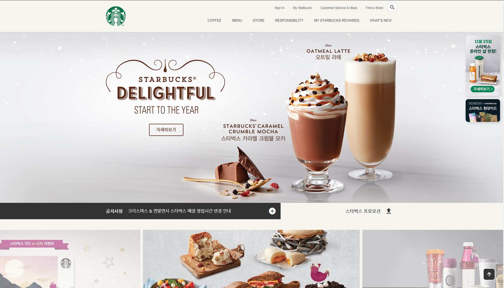
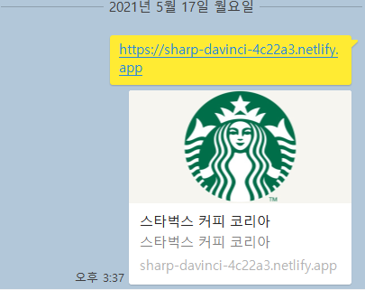

# 스타벅스

스타벅스 랜딩 페이지입니다.  

[DEMO](https://sharp-davinci-4c22a3.netlify.app)


# 문자 인코딩(Character Encoding) 설정

문자가 인코딩 되는 방식 설정합니다.
```html
<meta charset="UTF-8" />
```
- `UTF-8`: 초성, 중성, 종성으로 구분하여 문자를 작성

# 뷰포트(Viewport) 렌더링 방식 설정

웹페이지가 화면(Viewport)에 표현되는 방식을 설정합니다.  
모바일 환경에서 적용됩니다.

```html
<meta name="viewport" content="width=device-width, initial-scale=1.0" />
```

- `width=device-width`: 화면의 가로 너비를 각 디바이스(Device)의 가로 너비와 동일하게 적용
- `initial-scale=1.0`: 화면의 초기 화면 배율(확대 정도)을 설정
- `user-scalable=no`: 사용자가 디바이스 화면을 확대(`yes`)/축소(`no`)할수있는지 설정
- `maximum-scale=1`: 사용자가 화면을 확대할 수 있는 최댓값
- `minimum-scale=1`: 사용자가 화면을 축소할 수 있는 최솟값

# 오픈 그래프(The Open Graph protocol)

웹페이지가 소셜 미디어(페이스북 등)로 공유될 때 우선적으로 보여지는 정보를 지정합니다. 

카카오톡-  

  

<a href="https://ogp.me/" title="_blank">더 많은 오픈 그래프 속성 보기</a>  
```html
<meta property="og:type" content="website" />
<meta property="og:site_name" content="Starbucks" />
<meta property="og:title" content="Starbucks Coffee Korea" />
<meta property="og:description" content="스타벅스는 세계에서 가장 큰 다국적 커피 전문점으로, 64개국에서 총 23,187개의 매점을 운영하고 있습니다." />
<meta property="og:image" content="./images/starbucks_seo.jpg" />
<meta property="og:url" content="https://starbucks.co.kr" />
```

- `og:type`: 페이지의 유형
- `og:site_name`: 해당 사이트의 이름
- `og:title`: 페이지의 이름(제목)
- `og:description`: 페이지의 간단한 설명
- `og:image`: 페이지의 대표 이미지 주소(URL)
- `og:url`: 페이지 주소(URL)  
  
# 트위터 카드(Twitter Cards)

웹페이지가 소셜 미디어(트위터)로 공유될 때 우선적으로 보여지는 정보를 지정합니다.

<a href="https://developer.twitter.com/en/docs/twitter-for-websites/cards/guides/getting-started" title="_blank">더많은 트위터 카드 보기</a>

```html
<meta property="twitter:card" content="summary" />
<meta property="twitter:site" content="Starbucks" />
<meta property="twitter:title" content="Starbucks Coffee Korea" />
<meta property="twitter:description" content="스타벅스는 세계에서 가장 큰 다국적 커피 전문점으로, 64개국에서 총 23,187개의 매점을 운영하고 있습니다." />
<meta property="twitter:image" content="./images/starbucks_seo.jpg" />
<meta property="twitter:url" content="https://starbucks.co.kr" />
```

- `twitter:card`: 페이지(카드)의 유형
- `twitter:site`: 해당 사이트의 이름
- `twitter:title`: 페이지의 이름(제목)
- `twitter:description`: 페이지의 간단한 설명
- `twitter:image`: 페이지의 대표 이미지 주소(URL)
- `twitter:url`: 페이지 주소(URL)

# Favicon(파비콘, favicon)

웹페이지를 나타내는 아이콘, 웹페이의 로고를 설정합니다.
대부분의 경우 루트 경로에 `favicon.ico` 파일을 위치하면 자동으로 로딩하기 때문에 `<link />` 를 작성할 필요가 없습니다. `favicon.png` 파일을 사용하려면 다음과 같이 `<link />` 를 작성하세요.  

**루트경로안에 파비콘 이미지가 있어야 합니다!**

```html
<!--<link rel="shortcut icon" href="favicon.ico" />-->
<link rel="icon" href="./favicon.png" />
```
- `favicon.ico`: 64 x 64 or 32 x 32 or 16 x 16 (px)
- `favicon.png`: 500 x 500 (px)

<br />


## .ico 파일 제작 

이미지를 업로드하면 손쉽게 `.ico` 파일을 제작할 수 있습니다.

<a href="https://iconifier.net/">.ico 파일 만들러 가기</a>  

# Reset.css

각 브라우저의 기본 스타일을 초기화합니다.

```html
<link rel="stylesheet" href="https://cdn.jsdelivr.net/npm/reset-css@5.0.1/reset.min.css" />
```

# Google Fonts

페이지에서 사용할 '나눔 고딕' 폰트를 지정합니다.  

<a href="https://fonts.google.com/"> Google Fonts 로 가기</a>  

**폰트 라이센스를 확인해야합니다.**

Google Fonts 에서 고른 폰트 파일을 가져옵니다.

```html 
<link rel="preconnect" href="https://fonts.gstatic.com">
<link href="https://fonts.googleapis.com/css2?family=Nanum+Gothic:wght@400;700&display=swap" rel="stylesheet">
```

페이지에 폰트를 적용합니다. 
```css
body {
    font-family: 'Nanum Gothic', sans-serif;
}
```

# Google Material Icons 
<a href="https://fonts.google.com/icons?selected=Material+Icons">Google Meaterial Icons</a> 에서 무료로 적용 가능합니다.  

<a href="https://material.io/develop/web/getting-started">웹에서 시작하는 방법</a>

```html
<link rel="stylesheet" href="https://fonts.googleapis.com/icon?family=Material+Icons" />
```
Example-

```html
<div class="material-icons">upload</div>
```

# GSAP & ScrollToPlugin

<a href="https://greensock.com/gsap/">GSAP</a> 은 스크립트 애니메이션을 위한 도구 라이브러리입니다.  

<a href="https://greensock.com/scrolltoplugin/">ScrollToPlugin</a> 은 GSAP 플러그인에서 스크롤 애니메이션을 지원합니다.

```html
<script src="https://cdnjs.cloudflare.com/ajax/libs/gsap/3.5.1/gsap.min.js" integrity="sha512-IQLehpLoVS4fNzl7IfH8Iowfm5+RiMGtHykgZJl9AWMgqx0AmJ6cRWcB+GaGVtIsnC4voMfm8f2vwtY+6oPjpQ==" crossorigin="anonymous"></script>
<script src="https://cdnjs.cloudflare.com/ajax/libs/gsap/3.5.1/ScrollToPlugin.min.js" integrity="sha512-nTHzMQK7lwWt8nL4KF6DhwLHluv6dVq/hNnj2PBN0xMl2KaMm1PM02csx57mmToPAodHmPsipoERRNn4pG7f+Q==" crossorigin="anonymous"></script>
```

<a href="https://greensock.com/docs/v3/GSAP/gsap.to()">.to() 사용법</a>, <a href="https://greensock.com/docs/v2/Easing">GSAP Easing</a>  

```html
<script src="https://cdnjs.cloudflare.com/ajax/libs/gsap/3.6.1/gsap.min.js" integrity="sha512-cdV6j5t5o24hkSciVrb8Ki6FveC2SgwGfLE31+ZQRHAeSRxYhAQskLkq3dLm8ZcWe1N3vBOEYmmbhzf7NTtFFQ==" crossorigin="anonymous"></script>
<script src="https://cdnjs.cloudflare.com/ajax/libs/gsap/3.6.1/ScrollToPlugin.min.js" integrity="sha512-kSI9CgGh60rJbNVeMJvfNX0UTKAq8LEOea/yKJQbFpIroxT7bf9/zUFXbnfsQP5F6xlOOHtCfBPgsE1ceiHnRw==" crossorigin="anonymous"></script>
```

```javascript
gsap.to(요소, 시간, 옵션)
// 또는
TweenMax.to(요소, 시간, 옵션)
```
```javascript
gsap.to(window, .7, {
  scrollTo: 0
});
```

# Swiper

<a href="https://swiperjs.com/">Swiper</a> 는 하드웨어 가속 전환과 놀라운 기본 동작을 갖춘 가장 현대적인 무료터치 슬라이드 라이브러리입니다.

<a href="https://swiperjs.com/get-started">Swiper 시작하기</a>

```html
<!-- in HEAD -->
<link rel="stylesheet" href="https://unpkg.com/swiper/swiper-bundle.min.css" />
<script src="https://unpkg.com/swiper/swiper-bundle.min.js"></script>

<!-- in BODY -->
<div class="swiper-container">
  <div class="swiper-wrapper">
    <div class="swiper-slide">1</div>
    <div class="swiper-slide">2</div>
    <div class="swiper-slide">3</div>
  </div>
</div>
```
<a href="https://swiperjs.com/swiper-api">Swiper Api 옵션</a>

```javascript
new Swiper(요소, 옵션);
```
```javascript
new Swiper('.swiper-container', {
  direction: 'vertical', // 수직 슬라이드
  autoplay: true, // 자동 재생 여부
  loop: true // 반복 재생 여부
});
```

# Youtube API

<a href="https://developers.google.com/youtube/iframe_api_reference?hl=ko">IFrame Player API</a> 를 통해 YouTube 동영상을 제어할 수 있습니다. 

```html
<!-- in HEAD -->
<script defer src="./js/youtube.js"></script>

<!-- in BODY -->
<div id="player"></div>
```
`onYoutubePlayerAPIReady` 함수이름은 YoutubeAPI 에서 제공하는 것이기때문에 함수이름을 변경하면 작동하지 않습니다.  
그리고 함수는 전역 등록해야 합니다.  

<a href="https://developers.google.com/youtube/player_parameters.html?playerVersion=HTML5&hl=ko#Parameters">PlayerVars 확인</a>

```javascript
// Youtube IFrame API를 비동기로 로드합니다.
var tag = document.createElement('script');
tag.src = "https://www.youtube.com/iframe_api";
var firstScriptTag = document.getElementsByTagName('script')[0];
firstScriptTag.parentNode.insertBefore(tag, firstScriptTag);

function onYouTubePlayerAPIReady() {
  // <div id="player"></div>
  new YT.Player('player', {
    videoId: 'An6LvWQuj_8', // 재생할 유튜브 영상 ID
    playerVars: {
      autoplay: true, // 자동 재생 유무
      loop: true, // 반복 재생 유무
      playlist: 'An6LvWQuj_8' // 반복 재생할 유튜브 영상 ID 목록
    },
    events: {
      // 영상이 준비되었을 때,
      onReady: function (event) {
        event.target.mute(); // 음소거!
      }
    }
  });
}
```

# ScrollMagic

<a href="https://github.com/janpaepke/ScrollMagic">ScrollMagic</a> 은 스크롤과 요소의 상호 작용을 위한 자바스크립트 라이브러리 입니다.  

<a href="http://scrollmagic.io/docs/">ScrollMagic API</a>

```html
<script src="https://cdnjs.cloudflare.com/ajax/libs/ScrollMagic/2.0.8/ScrollMagic.min.js" integrity="sha512-8E3KZoPoZCD+1dgfqhPbejQBnQfBXe8FuwL4z/c8sTrgeDMFEnoyTlH3obB4/fV+6Sg0a0XF+L/6xS4Xx1fUEg==" crossorigin="anonymous"></script>
```
```javascript
new ScrollMagic
  .Scene({ // 감시할 장면(Scene)을 추가
    triggerElement: spyEl, // 보여짐 여부를 감시할 요소를 지정
    triggerHook: .8 // 화면의 80% 지점에서 보여짐 여부 감시
  })
  .setClassToggle(spyEl, 'show') // 요소가 화면에 보이면 show 클래스 추가
  .addTo(new ScrollMagic.Controller()) // 컨트롤러에 장면을 할당(필수!)
```

# Lodash

<a href="https://lodash.com/">Lodash</a> 는 다양한 유릴리티 기능을 제공하는 자바스크립트 라이브러리입니다.  

<a href="https://lodash.com/docs/4.17.15">Lodash API</a>  
<a href="https://lodash.com/docs/4.17.15#throttle">Lodash throttle</a>

```html
<script src="https://cdnjs.cloudflare.com/ajax/libs/lodash.js/4.17.21/lodash.min.js" integrity="sha512-WFN04846sdKMIP5LKNphMaWzU7YpMyCU245etK3g/2ARYbPK9Ub18eG+ljU96qKRCWh+quCY7yefSmlkQw1ANQ==" crossorigin="anonymous"></script>
```

# 랜덤 숫자생성 함수

```javascript
// 범위 랜덤 함수(소수점 2자리까지)
function random(min, max) {
  // `.toFixed()`를 통해 반환된 문자 데이터를,
  // `parseFloat()`을 통해 소수점을 가지는 숫자 데이터로 변환
  return parseFloat((Math.random() * (max - min) + min).toFixed(2))
}
```


